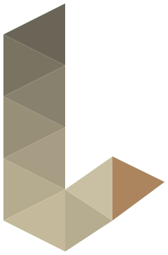

#  LPad

An autonomous ecosystem of tools to help me run my life, starting with embedded systems for financial data visualization.

 

## 🛠️ Development Environment (macOS)

To build and extend this project, you need the following tools installed on your system.

### Base Dependencies (Homebrew)
```bash
# PlatformIO Core (Build System)
brew install platformio

# Node.js (Required for Mermaid CLI)
brew install node

# Git & Python3 (Standard)
brew install git python3
```

### Visual Tooling (NPM)
We use `mermaid-cli` to generate architecture diagrams directly in the terminal.
```bash
# Mermaid CLI
npm install -g @mermaid-js/mermaid-cli
```

### IDE Support
*   **VS Code** with the **PlatformIO IDE** extension is highly recommended.
*   **iTerm2** is recommended for terminal usage to support inline image rendering of graphs.

---

## 🧠 The Agentic Workflow

This project is not built by humans writing C++. It is constructed using a rigorous **Agentic Workflow** where:

1.  **The Architect (User/Gemini):** Defines *what* the system does using Gherkin-style Feature Files (`features/*.md`) and maintains the System Constitution (`docs/ARCHITECTURE.md`).
2.  **The Builder (Claude):** Reads the specs and writes the code to satisfy them, committing strictly when tests pass.
3.  **The Process (Scripts):** Automated scripts (`ai_dev_tools/cdd.sh`) monitor file timestamps to enforce a "Stale Spec = Broken Build" philosophy.

### Core Principles
*   **Feature-First:** The `features/` directory is the Source of Truth.
*   **Code is Disposable:** `src/` can be deleted and rebuilt entirely from the features.
*   **Layered Architecture:** Strict separation between Hardware Abstraction Layer (HAL) and Application Logic.

---

### Agent Configuration

This project includes a `.gemini/settings.json` file. This file provides project-specific configuration for the Gemini CLI agent, which plays the "Architect" role.

-   **`context.fileName`**: This setting automatically loads the `GEMINI_ARCHITECT.md` file into the agent's context at the start of a session. This ensures the "Architect" agent is always aware of its core mission, responsibilities, and the project's development philosophy without needing to be manually prompted.

By checking this file into the repository, we ensure that any developer (or agent) using this project will have their tools configured consistently.

---

## 🏗️ Project Architecture

### Dependency Graph
The following DAG (Directed Acyclic Graph) represents the current feature set and their dependencies. This is generated automatically from the `features/` directory.

```mermaid
graph TD
    %% Styling
    classDef default fill:#e1f5fe,stroke:#01579b,stroke-width:1px,color:black;
    classDef release fill:#f96,stroke:#333,stroke-width:2px,color:black,font-weight:bold;
    classDef hardware fill:#e8f5e9,stroke:#2e7d32,stroke-width:1px,color:black;
    classDef ui fill:#f3e5f5,stroke:#7b1fa2,stroke-width:1px,color:black;
    classDef app fill:#fff3e0,stroke:#e65100,stroke-width:1px,color:black;
    classDef graphics fill:#e0f7fa,stroke:#006064,stroke-width:1px,color:black;


    subgraph Application_Layer ["<div class='subgraph-title'>Application Layer</div><div style='height: 150px;'></div>"]
        direction TB
        app_animation_ticker("**Animation Ticker Engine**<br/><small>app_animation_ticker.md</small>"):::app
        app_config_system("**Config Injection System**<br/><small>app_config_system.md</small>"):::app
        touch_gesture_engine("**Touch Gesture Engine**<br/><small>touch_gesture_engine.md</small>"):::app
        ui_logo_screen("**Logo Splash Screen**<br/><small>ui_logo_screen.md</small>"):::app
    end

    subgraph Board_Drivers ["<div class='subgraph-title'>Board Drivers</div><div style='height: 150px;'></div>"]
        direction TB
        display_esp32s3_amoled("**ESP32-S3 AMOLED Driver**<br/><small>display_esp32s3_amoled.md</small>")
        display_tdisplay_s3_plus("**T-Display S3+ Driver**<br/><small>display_tdisplay_s3_plus.md</small>")
    end

    subgraph Data_Layer ["<div class='subgraph-title'>Data Layer</div><div style='height: 150px;'></div>"]
        direction TB
        data_layer_core("**Base Data Model**<br/><small>data_layer_core.md</small>")
        data_layer_stock_tracker("**Data Stock Tracker**<br/><small>data_layer_stock_tracker.md</small>")
        data_layer_time_series("**Time Series Data Item**<br/><small>data_layer_time_series.md</small>")
    end

    subgraph Graphics_Engine ["<div class='subgraph-title'>Graphics Engine</div><div style='height: 150px;'></div>"]
        direction TB
        display_canvas_drawing("**Layered Canvas Drawing**<br/><small>display_canvas_drawing.md</small>"):::graphics
        display_relative_drawing("**Relative Drawing**<br/><small>display_relative_drawing.md</small>"):::graphics
        ui_vector_assets("**Vector Asset Pipeline**<br/><small>ui_vector_assets.md</small>"):::graphics
    end

    subgraph Hardware_Layer ["<div class='subgraph-title'>Hardware Layer</div><div style='height: 150px;'></div>"]
        direction TB
        display_rotation_contract("**Rotation Contract**<br/><small>display_rotation_contract.md</small>"):::hardware
        display_target_rotation("**Target Rotation**<br/><small>display_target_rotation.md</small>"):::hardware
        hal_core_contract("**HAL Core Contract**<br/><small>hal_core_contract.md</small>"):::hardware
        hal_dma_blitting("**DMA Blitting**<br/><small>hal_dma_blitting.md</small>"):::hardware
        hal_spec_display("**HAL Display Specification**<br/><small>hal_spec_display.md</small>"):::hardware
        hal_spec_network("**HAL Network Specification**<br/><small>hal_spec_network.md</small>"):::hardware
        hal_spec_timer("**HAL Timer Specification**<br/><small>hal_spec_timer.md</small>"):::hardware
        hal_spec_touch("**HAL: Touch Spec**<br/><small>hal_spec_touch.md</small>"):::hardware
        hal_timer_esp32("**ESP32 Timer**<br/><small>hal_timer_esp32.md</small>"):::hardware
        touch_cst816_implementation("**HAL: CST816 Impl**<br/><small>touch_cst816_implementation.md</small>"):::hardware
    end

    subgraph Release ["<div class='subgraph-title'>Release</div><div style='height: 150px;'></div>"]
        direction TB
        RELEASE_v0_65_touch_interaction("**Release v0.65 (Touch)**<br/><small>RELEASE_v0.65_touch_interaction.md</small>"):::release
    end

    subgraph Release_Demos ["<div class='subgraph-title'>Release Demos</div><div style='height: 150px;'></div>"]
        direction TB
        demo_release_0_5("**Demo for Release v0.5**<br/><small>demo_release_0.5.md</small>"):::release
        demo_release_0_55("**Demo for Release v0.55**<br/><small>demo_release_0.55.md</small>"):::release
        demo_release_0_58("**Demo for Release v0.58**<br/><small>demo_release_0.58.md</small>"):::release
        demo_release_0_60("**Demo v0.60**<br/><small>demo_release_0.60.md</small>"):::release
    end

    subgraph Releases ["<div class='subgraph-title'>Releases</div><div style='height: 150px;'></div>"]
        direction TB
        RELEASE_v0_55_connectivity_smoke_test("**Release v0.55 - Connectivity Smoke Test**<br/><small>RELEASE_v0.55_connectivity_smoke_test.md</small>"):::release
        RELEASE_v0_58_dynamic_visuals("**Release v0.58 - Dynamic Visuals**<br/><small>RELEASE_v0.58_dynamic_visuals.md</small>"):::release
        RELEASE_v0_5_display_drawing_ui_base("**Release v0.5 - Display, Drawing & UI Base**<br/><small>RELEASE_v0.5_display_drawing_ui_base.md</small>"):::release
        RELEASE_v0_60_initial_stock_tracker("**Release v0.60**<br/><small>RELEASE_v0.60_initial_stock_tracker.md</small>"):::release
    end

    subgraph UI_Framework ["<div class='subgraph-title'>UI Framework</div><div style='height: 150px;'></div>"]
        direction TB
        ui_base("**Base UI Elements**<br/><small>ui_base.md</small>"):::ui
        ui_connectivity_status_screen("**Connectivity Status Screen**<br/><small>ui_connectivity_status_screen.md</small>"):::ui
        ui_live_indicator("**Animated Live Indicator**<br/><small>ui_live_indicator.md</small>"):::ui
        ui_mini_logo("**UI Mini Logo**<br/><small>ui_mini_logo.md</small>"):::ui
        ui_theme_support("**Theme Support**<br/><small>ui_theme_support.md</small>"):::ui
        ui_themeable_time_series_graph("**Themeable Graph**<br/><small>ui_themeable_time_series_graph.md</small>"):::ui
        ui_themeable_time_series_graph_v2("**UI Time Series Graph v2**<br/><small>ui_themeable_time_series_graph_v2.md</small>"):::ui
        ui_touch_test_overlay("**UI: Touch Overlay**<br/><small>ui_touch_test_overlay.md</small>"):::ui
    end

    %% Relationships
    RELEASE_v0_5_display_drawing_ui_base --> RELEASE_v0_55_connectivity_smoke_test
    hal_spec_network --> RELEASE_v0_55_connectivity_smoke_test
    app_config_system --> RELEASE_v0_55_connectivity_smoke_test
    ui_connectivity_status_screen --> RELEASE_v0_55_connectivity_smoke_test
    demo_release_0_55 --> RELEASE_v0_55_connectivity_smoke_test
    RELEASE_v0_55_connectivity_smoke_test --> RELEASE_v0_58_dynamic_visuals
    data_layer_time_series --> RELEASE_v0_58_dynamic_visuals
    demo_release_0_58 --> RELEASE_v0_58_dynamic_visuals
    hal_spec_display --> RELEASE_v0_5_display_drawing_ui_base
    hal_spec_timer --> RELEASE_v0_5_display_drawing_ui_base
    hal_timer_esp32 --> RELEASE_v0_5_display_drawing_ui_base
    hal_dma_blitting --> RELEASE_v0_5_display_drawing_ui_base
    display_rotation_contract --> RELEASE_v0_5_display_drawing_ui_base
    display_target_rotation --> RELEASE_v0_5_display_drawing_ui_base
    display_esp32s3_amoled --> RELEASE_v0_5_display_drawing_ui_base
    display_tdisplay_s3_plus --> RELEASE_v0_5_display_drawing_ui_base
    display_canvas_drawing --> RELEASE_v0_5_display_drawing_ui_base
    display_relative_drawing --> RELEASE_v0_5_display_drawing_ui_base
    ui_base --> RELEASE_v0_5_display_drawing_ui_base
    app_animation_ticker --> RELEASE_v0_5_display_drawing_ui_base
    ui_live_indicator --> RELEASE_v0_5_display_drawing_ui_base
    ui_theme_support --> RELEASE_v0_5_display_drawing_ui_base
    ui_vector_assets --> RELEASE_v0_5_display_drawing_ui_base
    ui_logo_screen --> RELEASE_v0_5_display_drawing_ui_base
    demo_release_0_5 --> RELEASE_v0_5_display_drawing_ui_base
    RELEASE_v0_58_dynamic_visuals --> RELEASE_v0_60_initial_stock_tracker
    demo_release_0_60 --> RELEASE_v0_60_initial_stock_tracker
    ui_touch_test_overlay --> RELEASE_v0_65_touch_interaction
    hal_spec_timer --> app_animation_ticker
    hal_core_contract --> data_layer_core
    data_layer_time_series --> data_layer_stock_tracker
    data_layer_core --> data_layer_time_series
    data_layer_time_series --> demo_release_0_58
    demo_release_0_55 --> demo_release_0_58
    demo_release_0_58 --> demo_release_0_60
    ui_mini_logo --> demo_release_0_60
    data_layer_stock_tracker --> demo_release_0_60
    ui_themeable_time_series_graph_v2 --> demo_release_0_60
    ui_connectivity_status_screen --> demo_release_0_60
    hal_spec_display --> display_canvas_drawing
    hal_spec_display --> display_esp32s3_amoled
    hal_spec_display --> display_relative_drawing
    hal_spec_display --> display_tdisplay_s3_plus
    hal_core_contract --> hal_spec_display
    hal_core_contract --> hal_spec_network
    hal_core_contract --> hal_spec_timer
    hal_core_contract --> hal_spec_touch
    hal_spec_timer --> hal_timer_esp32
    hal_spec_touch --> touch_cst816_implementation
    hal_spec_touch --> touch_gesture_engine
    hal_spec_network --> ui_connectivity_status_screen
    ui_base --> ui_connectivity_status_screen
    ui_vector_assets --> ui_logo_screen
    app_animation_ticker --> ui_logo_screen
    ui_logo_screen --> ui_mini_logo
    display_canvas_drawing --> ui_theme_support
    ui_themeable_time_series_graph --> ui_themeable_time_series_graph_v2
    touch_gesture_engine --> ui_touch_test_overlay
    display_relative_drawing --> ui_vector_assets
```

<!-- MERMAID_START -->

<!-- MERMAID_END -->

### Directory Structure

| Directory | Role |
| :--- | :--- |
| `features/` | **Source of Truth.** Gherkin-style specifications. |
| `src/` | **Application Logic.** High-level code (e.g., Graph drawing, Data parsing). |
| `hal/` | **Hardware Abstraction.** Drivers for Display, Timer, etc. |
| `docs/` | **Knowledge Base.** Architecture rules (`ARCHITECTURE.md`) and Implementation Log (`IMPLEMENTATION_LOG.md`). |
| `ai_dev_tools/` | **Agentic Tooling.** `cdd.sh` (Status Monitor) and `software_map/` (Visualization). |
| `scripts/` | **Build Utility.** Helper scripts for firmware generation (Fonts, SVGs). |

---

## 🚀 Getting Started

1.  **Environment:** PlatformIO + VS Code.
2.  **Monitor Status:** Run `./ai_dev_tools/cdd.sh` to see the current development status.
3.  **Build:** `pio run` to compile.
4.  **Upload:** `pio run -t upload` to flash the target.

## 📜 Documentation

*   [System Constitution](docs/ARCHITECTURE.md) - The rules of the road.
*   [Implementation Log](docs/IMPLEMENTATION_LOG.md) - Lessons learned and technical decisions.
*   [Agent Instructions](CLAUDE.md) - The prompt context for the Builder agent.