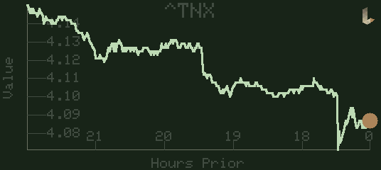
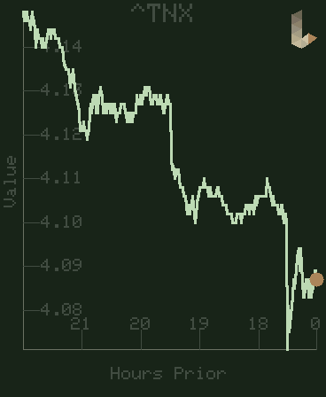

# LPad: Agentic Embedded Development




**LPad** is an experimental ESP32 project that serves as a proving ground for a **Spec-Driven Agentic Workflow**.

The primary goal of this repository is not just the firmware itself, but the *process* of building it. We use a rigorous "Two-Agent" model where **Gemini** acts as the Architect and **Claude** acts as the Developer, with **You** (the Human) as the Executive/Process Manager.

## The Agentic Workflow

This project uses a rigorous **Two-Agent model** managed by a reusable **Agentic DevOps Framework**. This framework is designed to be project-agnostic and can be bootstrapped into any development environment (C++, Web, Data Science, etc.).

### The Framework ([`agentic_devops/`](agentic_devops/))

*   **[`HOW_WE_WORK.md`](agentic_devops/HOW_WE_WORK.md):** The core philosophy and constitutional rules of the agentic collaboration.
*   **[`ARCHITECT_INSTRUCTIONS.md`](agentic_devops/ARCHITECT_INSTRUCTIONS.md):** The operational mandate for the Architect agent (Gemini).
*   **[`BUILDER_INSTRUCTIONS.md`](agentic_devops/BUILDER_INSTRUCTIONS.md):** The coding standards and commit protocols for the Builder agent (Claude).
*   **[Tools](agentic_devops/tools/):** Generic automation for tracking feature status (CDD) and visualizing dependencies (Software Map).

### Documentation Structure

*   **`features/arch_*.md` (The Constitution):** Defines system invariants and modular architectural policies (e.g., `arch_hal_policy.md`, `arch_ui_compositing.md`).
*   **`features/*.md` (The Living Spec):** The single source of truth for functionality. Includes behavioral requirements and **Colocated Implementation Notes** capturing tribal knowledge and hardware "gotchas."

## Agentic Evolution

This project evolves both its **Firmware Capabilities** and its **DevOps Processes** in parallel. We track these milestones together to show how better agentic workflows enable more complex software.

| Release | Firmware Capabilities | Agentic DevOps Process |
| :--- | :--- | :--- |
| **v0.1 - v0.5** | **Foundation:** Basic Display/HAL, Relative Drawing, Time Series Graph (v1). | **Static Specs:** Traditional documentation. Manual validation. |
| **v0.5 - v0.65** | **Feature Expansion:** WiFi, Stock Tracker, Touch Gestures, MiniLogo. | **Versioned Specs:** `feature_v2.md` files (superseding). Centralized `IMPLEMENTATION_LOG.md`. |
| **v0.70** | **System Architecture:** UI Render Manager, Z-Order, Multi-App Support. | **Agentic DevOps Refactor:** Unified `agentic_devops/` hub. **Living Specs:** In-place editing (No v2). **Knowledge Colocation:** Implementation notes inside feature files. **Modular Architecture:** `arch_*.md` policies. |
| **v0.71** | **Developer Utility:** Serial Screenshot Tool, PSRAM Shadow Framebuffer. | **Process Rigor:** Acyclic Dependency Mandate. Test Fidelity Mandate (Explicit HIL steps). Documentation Professionalism (No Emojis). |
| **v0.72** | **UI Widgets & WiFi:** Formal Widget System (Layouts/Relative Positioning); Multi-WiFi HAL with fallback; "Window Shade" menu. | **Milestone Mutation:** Single active Release Specification rule. Consistent visual hierarchy refinement (The "Section" style). |

## Testing Strategy

We employ a dual-layer testing strategy to ensure both logic correctness and hardware fidelity.

### 1. Unit Testing (Native)
*   **Purpose:** Verifies business logic, data processing, and UI layout math without needing physical hardware.
*   **Execution:** Runs on the host machine (Mac/Linux/Windows) using the PlatformIO native environment.
*   **Command:**
    ```bash
    pio test -e native_test
    ```

### 2. Hardware-in-Loop (HIL) Testing
*   **Purpose:** Verifies that the code works correctly on the physical ESP32 boards (e.g., display drivers, touch response, WiFi).
*   **Execution:** These are often visual or interactive tests defined in the `## Hardware (HIL) Test` section of a feature file. The Builder implements a temporary demo in `main.cpp` to prove the feature works.
*   **Validation:** Requires human-in-the-loop confirmation.

### 3. CDD Monitor & Test Status
The **Continuous Documentation Dashboard (CDD)** monitors the lifecycle of a feature:
*   **`TODO`**: The spec file (`features/X.md`) has been modified more recently than the last implementation commit.
*   **`TESTING`**: The Builder has implemented the feature and created a commit with the tag `[Ready for HIL Test features/X.md]`. This signals that unit tests pass and it's ready for physical board verification.
*   **`DONE`**: Once verified on hardware (or by passing final integration tests), a commit with the tag `[Complete features/X.md]` marks the feature as finished.

---

## DevOps & Tooling

We have built custom tooling to visualize and manage this workflow.

### 1. CDD Web Monitor (Continuous Documentation Dashboard)
A real-time dashboard that tracks the synchronization between Specs and Code.
*   **Function:** Monitors git commit timestamps. If a Feature File is newer than its implementation commit, it flags the feature as `[TODO]`.
*   **Usage:**
    ```bash
    ./agentic_devops/tools/cdd/start.sh
    # Open http://localhost:8086
    ```

### 2. Software Map (Dependency Visualization)
An interactive node graph of the project's feature dependencies.
*   **Function:** Visualizes the hierarchy from `RELEASE` nodes down to specific hardware specs.
*   **Usage:**
    ```bash
    ./agentic_devops/tools/software_map/start.sh
    # Open http://localhost:8085
    ```

### Setup
Ensure you have Python 3 installed. The tools use standard libraries or minimal dependencies.
*   **PlatformIO:** Required for building the firmware.
    ```bash
    pip install platformio
    ```
*   **Screenshot Tool:** Requires `pyserial` and `Pillow`. The capture scripts automatically activate the project's local `.venv`.
    ```bash
    # Ensure the virtual environment is prepared
    python3 -m venv .venv
    source .venv/bin/activate
    pip install pyserial Pillow
    ```

---

## Supported Hardware (HAL)

This project uses a strict **Hardware Abstraction Layer (HAL)**. Application code never touches hardware directly.

We currently support two primary boards from LilyGo:

| Board Name | Environment Name | Key Features |
| :--- | :--- | :--- |
| **[Waveshare ESP32-S3 1.8 AMOLED Touch](https://www.waveshare.com/esp32-s3-touch-amoled-1.8.htm?srsltid=AfmBOoqeOA9TgJGfhIbtYCvXR7oEmlO_g-zDU1NZwziZdzl7I1HydyTj)** | `env:esp32s3` | 1.8" AMOLED (SH8601), CST816 Touch |
| **[LilyGo T-Display-S3 AMOLED Plus](https://github.com/Xinyuan-LilyGO/LilyGo-AMOLED-Series?tab=readme-ov-file)** | `env:tdisplay_s3_plus` | 1.91" AMOLED (RM67162), CST816 Touch |

### Build Commands
To build and upload the latest verified release:
```bash
# For AMOLED version
pio run -e esp32s3 -t upload

# For Plus version
pio run -e tdisplay_s3_plus -t upload
```

---

## Current Features (Firmware)

The firmware is currently at **Milestone v0.72**.

*   **UI Widget System:** Modular framework for building interactive UI elements using relative coordinates and grid-based layout heuristics.
*   **Multi-WiFi Management:** Support for multiple APs with automated boot-time fallback and manual runtime selection via a scrollable list.
*   **System Menu v2:** Refactored widget-based menu with "window shade" animation and real-time connectivity status.
*   **Serial Screenshot Tool:** Host-side utility to capture the device screen over Serial using a PSRAM shadow buffer.
*   **UI Render Manager:** Centralized orchestration of Apps and System Tools with Z-Order and occlusion optimization.
*   **System Components:** Global overlay Menu and MiniLogo managed independently of the active App.
*   **Graph V2 Engine:** High-performance, thread-safe plotting engine with autonomous layout and collision avoidance.
*   **Stock Tracker:** Real-time stock data tracking using the Yahoo Finance API (via WiFi).
*   **Touch Interaction:** Full gesture engine supporting Tap, Hold, and Edge Drag operations.
*   **Agentic CI/CD:** Automated verification of feature states via the CDD Monitor and Living Spec architecture.


## License
This project is licensed under the **Creative Commons Attribution-NonCommercial-ShareAlike 4.0 International (CC BY-NC-SA 4.0)**. See the [LICENSE.md](LICENSE.md) file for details.
