# 10-Year Treasury Bond Tracker (ESP32-S3)

An autonomous embedded systems project demonstrating "Vaporwave" financial data visualization on ESP32-S3 AMOLED displays.

 

## 🧠 The Agentic Workflow

This project is not built by humans writing C++. It is constructed using a rigorous **Agentic Workflow** where:

1.  **The Architect (User/Gemini):** Defines *what* the system does using Gherkin-style Feature Files (`features/*.md`) and maintains the System Constitution (`docs/ARCHITECTURE.md`).
2.  **The Builder (Claude):** Reads the specs and writes the code to satisfy them, committing strictly when tests pass.
3.  **The Process (Scripts):** Automated scripts (`cdd.sh`) monitor file timestamps to enforce a "Stale Spec = Broken Build" philosophy.

### Core Principles
*   **Feature-First:** The `features/` directory is the Source of Truth.
*   **Code is Disposable:** `src/` can be deleted and rebuilt entirely from the features.
*   **Layered Architecture:** Strict separation between Hardware Abstraction Layer (HAL) and Application Logic.

---

## 🏗️ Project Architecture

### Dependency Graph
The following DAG (Directed Acyclic Graph) represents the current feature set and their dependencies. This is generated automatically from the `features/` directory.

```mermaid
graph TD
    %% Node Definitions
    RELEASE_v0_5_static_graph("Release v0.5: Static Graph & Animation Engine<br/><small>RELEASE_v0.5_static_graph.md</small>"):::release
    app_animation_ticker("app_animation_ticker.md<br/><small>app_animation_ticker.md</small>")
    app_bond_tracker("app_bond_tracker.md<br/><small>app_bond_tracker.md</small>")
    data_yahoo_chart_parser("data_yahoo_chart_parser.md<br/><small>data_yahoo_chart_parser.md</small>")
    display_canvas_drawing("display_canvas_drawing.md<br/><small>display_canvas_drawing.md</small>")
    display_esp32s3_amoled("display_esp32s3_amoled.md<br/><small>display_esp32s3_amoled.md</small>")
    display_relative_drawing("display_relative_drawing.md<br/><small>display_relative_drawing.md</small>")
    display_rotation_contract("display_rotation_contract.md<br/><small>display_rotation_contract.md</small>")
    display_target_rotation("display_target_rotation.md<br/><small>display_target_rotation.md</small>")
    display_tdisplay_s3_plus("display_tdisplay_s3_plus.md<br/><small>display_tdisplay_s3_plus.md</small>")
    hal_contracts("hal_contracts.md<br/><small>hal_contracts.md</small>")
    hal_dma_blitting("hal_dma_blitting.md<br/><small>hal_dma_blitting.md</small>")
    hal_timer_esp32("hal_timer_esp32.md<br/><small>hal_timer_esp32.md</small>")
    ui_themeable_time_series_graph("ui_themeable_time_series_graph.md<br/><small>ui_themeable_time_series_graph.md</small>")
    ui_time_series_graph("ui_time_series_graph.md<br/><small>ui_time_series_graph.md</small>")

    %% Relationships
    hal_contracts --> RELEASE_v0_5_static_graph
    hal_timer_esp32 --> RELEASE_v0_5_static_graph
    hal_dma_blitting --> RELEASE_v0_5_static_graph
    display_rotation_contract --> RELEASE_v0_5_static_graph
    display_target_rotation --> RELEASE_v0_5_static_graph
    display_esp32s3_amoled --> RELEASE_v0_5_static_graph
    display_tdisplay_s3_plus --> RELEASE_v0_5_static_graph
    display_canvas_drawing --> RELEASE_v0_5_static_graph
    display_relative_drawing --> RELEASE_v0_5_static_graph
    data_yahoo_chart_parser --> RELEASE_v0_5_static_graph
    app_animation_ticker --> RELEASE_v0_5_static_graph
    ui_time_series_graph --> RELEASE_v0_5_static_graph
    ui_themeable_time_series_graph --> RELEASE_v0_5_static_graph
    app_bond_tracker --> RELEASE_v0_5_static_graph
    hal_contracts --> app_animation_ticker
    hal_contracts --> display_canvas_drawing
    hal_contracts --> display_tdisplay_s3_plus
    hal_contracts --> hal_timer_esp32

    %% Styling
    classDef release fill:#f96,stroke:#333,stroke-width:2px,color:black;
    classDef default fill:#e1f5fe,stroke:#01579b,stroke-width:1px,color:black;
```

<!-- MERMAID_START -->

<!-- MERMAID_END -->

### Directory Structure

| Directory | Role |
| :--- | :--- |
| `features/` | **Source of Truth.** Gherkin-style specifications. |
| `src/` | **Application Logic.** High-level code (e.g., Graph drawing, Data parsing). |
| `hal/` | **Hardware Abstraction.** Drivers for Display, Timer, etc. |
| `docs/` | **Knowledge Base.** Architecture rules (`ARCHITECTURE.md`) and Implementation Log (`IMPLEMENTATION_LOG.md`). |
| `scripts/` | **Tooling.** `cdd.sh` (Status Monitor) and `generate_graph.sh` (Visualization). |

---

## 🚀 Getting Started

1.  **Environment:** PlatformIO + VS Code.
2.  **Monitor Status:** Run `./scripts/cdd.sh` to see the current development status.
3.  **Build:** `pio run` to compile.
4.  **Upload:** `pio run -t upload` to flash the target.

## 📜 Documentation

*   [System Constitution](docs/ARCHITECTURE.md) - The rules of the road.
*   [Implementation Log](docs/IMPLEMENTATION_LOG.md) - Lessons learned and technical decisions.
*   [Agent Instructions](CLAUDE.md) - The prompt context for the Builder agent.
