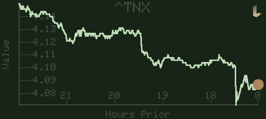
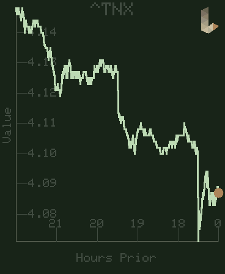

<p align="center">
  
</p>

<h1 align="center">LPad (Lab Pad)</h1>

<p align="center">
  An ESP32 proving ground for embedded agentic development.
</p>




**LPad** (Lab Pad) is an experimental ESP32 project that serves as a proving ground for **agentic embedded development** -- building real firmware through AI agent collaboration guided by living specifications.

The project has two purposes: deliver working embedded firmware for ESP32-S3 AMOLED devices, and push the boundaries of how AI agents can design, build, and verify real-world software.

---

## Supported Hardware (HAL)

LPad uses a strict **Hardware Abstraction Layer**. Application code never touches hardware directly.

| Board | Environment | Display | Touch |
| :--- | :--- | :--- | :--- |
| **[Waveshare ESP32-S3 1.8 AMOLED Touch](https://www.waveshare.com/esp32-s3-touch-amoled-1.8.htm)** | `env:esp32s3` | 1.8" AMOLED (SH8601, QSPI) | CST816 |
| **[LilyGo T-Display-S3 AMOLED Plus](https://github.com/Xinyuan-LilyGO/LilyGo-AMOLED-Series)** | `env:tdisplay_s3_plus` | 1.91" AMOLED (RM67162, SPI) | FT3168 |

### Build Commands

```bash
# Waveshare
pio run -e esp32s3 -t upload

# LilyGo T-Display S3 Plus
pio run -e tdisplay_s3_plus -t upload
```

---

## Current Features (Firmware v0.76)

- **Power Management:** Suspend/resume cycle with deep-sleep wakeup gate; boot sequence with animated logo.
- **Battery Status & Metering:** Background PMU/ADC monitoring with visual representation in the System Menu.
- **UI Render Manager:** Z-ordered component architecture with Painter's Algorithm rendering and occlusion optimization.
- **UI Widget System:** Modular framework using relative coordinates and grid-based layouts.
- **System Menu:** Widget-based overlay with "window shade" animation, WiFi selector, battery display, and version info.
- **Multi-WiFi Management:** Automated boot-time fallback across configured networks with manual runtime selection.
- **Stock Tracker:** Real-time Yahoo Finance API integration with time series graphing.
- **Touch Gestures:** Full gesture engine -- Tap, Hold, Hold-Drag, Swipe, and Edge Drag.
- **Theme System:** Runtime-switchable themes with RGB565 palette, font scale, and design tokens.
- **Serial Screenshot Tool:** Host-side capture of device display over serial using PSRAM shadow framebuffer.
- **Vector Rendering:** SVG triangle mesh renderer with build-time code generation pipeline.
- **Build Pipelines:** Config injection, SVG-to-C++ mesh generation, and TTF/OTF font compilation.

---

## Testing

### Unit Testing (Native)

Runs on the host machine using PlatformIO's native environment with Unity test framework and HAL stubs.

```bash
# Run all tests
./scripts/test_local.sh

# Or directly
pio test -e native_test
```

### Hardware-in-Loop (HIL) Testing

Visual and interactive tests defined in feature specs, verified on physical boards. Requires human confirmation.

---

## Agentic Development with Purlin

<p align="center">
  <a href="https://github.com/rlabarca/purlin">
    
  </a>
</p>

LPad uses **[Purlin](https://github.com/rlabarca/purlin)** as its agentic development framework. Purlin orchestrates three specialized AI agent roles -- **Architect** (specifications and design), **Builder** (implementation), and **QA** (verification) -- that collaborate asynchronously through a shared system of living specifications.

Key aspects of the Purlin-driven workflow:

- **Specifications are the source of truth.** Feature files in `features/` define all behavior in Gherkin-style scenarios. Code is disposable; specs are not.
- **Continuous Design-Driven (CDD) Monitor.** Tracks synchronization between specs and code in real time, surfacing drift immediately.
- **Critic system.** Automated quality gates validate spec completeness, test traceability, and policy compliance.
- **Dependency graph.** Anchor nodes define architectural constraints; features declare prerequisites, forming an acyclic dependency graph.

### Setup

Purlin is consumed as a git submodule at `purlin/`. The project's `.purlin/` directory contains project-specific overrides.

```bash
# CDD Dashboard
purlin/tools/cdd/status.sh
```

---

## Releases

LPad evolves both its firmware capabilities and its development process in parallel.

### Coupled Agentic Development

In these early releases, the agentic development framework was built directly inside the LPad repository. The process tooling and the firmware co-evolved as a single project.

| Release | Firmware Capabilities | Agentic DevOps Process |
| :--- | :--- | :--- |
| **v0.1 - v0.5** | **Foundation:** Basic Display/HAL, Relative Drawing, Time Series Graph (v1). | **Static Specs:** Traditional documentation. Manual validation. |
| **v0.5 - v0.65** | **Feature Expansion:** WiFi, Stock Tracker, Touch Gestures, MiniLogo. | **Versioned Specs:** `feature_v2.md` files (superseding). Centralized `IMPLEMENTATION_LOG.md`. |
| **v0.70** | **System Architecture:** UI Render Manager, Z-Order, Multi-App Support. | **Agentic DevOps Refactor:** Unified `agentic_devops/` hub. **Living Specs:** In-place editing (No v2). **Knowledge Colocation:** Implementation notes inside feature files. **Modular Architecture:** `arch_*.md` policies. |
| **v0.71** | **Developer Utility:** Serial Screenshot Tool, PSRAM Shadow Framebuffer. | **Process Rigor:** Acyclic Dependency Mandate. Test Fidelity Mandate (Explicit HIL steps). Documentation Professionalism. |
| **v0.72** | **UI Widgets & WiFi:** Formal Widget System (Layouts/Relative Positioning); Multi-WiFi HAL with fallback; "Window Shade" menu. | **Milestone Mutation:** Single active Release Specification rule. Consistent visual hierarchy refinement. |
| **v0.73** | **[STABLE]** No firmware changes. | **Meta-Process Evolution:** Spec-Driven Agentic DevOps; Recursive Governance; Universal/Portable Framework Refactor. |
| **v0.74** | **Hardware-Aware UI:** Battery Status & Metering with HAL Power abstraction; Dynamic rounded-corner safe UI overlays. | **Process Cleanup:** Reinforced "Single Release Specification" rule; Multi-target architectural parity mandate. |
| **v0.75** | **Power Management:** Suspend/Resume cycle; Application boot sequence with logo screen. | **CDD Monitor:** Filesystem-aware status detection for immediate `[TODO]` updates. |

### Development with Separate Purlin Process

Starting with v0.76, the agentic framework was extracted into its own project -- **[Purlin](https://github.com/rlabarca/purlin)** -- and consumed as a git submodule. This separation allows the framework to evolve independently and be reused across projects.

| Release | Changes |
| :--- | :--- |
| **v0.76** | Completely regenerated feature tree using Purlin. 6 anchor nodes, 31 feature specs, and companion files covering the full firmware surface -- HAL, UI framework, applications, data layer, system components, theme system, input, rendering, build pipelines, developer tools, and boot sequence. |

The v0.76 feature tree was generated from scratch using Purlin's `/pl-spec-from-code` skill, which reverse-engineers a complete specification system from existing source code. The original feature map from the coupled-era releases was not referenced. The entire 19,000+ line C/C++ codebase was analyzed and decomposed into anchor nodes, feature specs with Gherkin scenarios, and companion implementation notes -- proving that a full spec-driven design can be produced for Purlin from complex existing code without prior specifications.

---

## Setup

### Prerequisites

- [PlatformIO](https://platformio.org/) (CLI or IDE plugin)
- Python 3 (for build scripts and developer tools)

### Quick Start

```bash
# Clone with submodules
git clone --recurse-submodules https://github.com/rlabarca/LPad.git
cd LPad

# Copy config template and add your WiFi credentials
cp config.example.json config.json

# Build and upload (pick your board)
pio run -e esp32s3 -t upload
# or
pio run -e tdisplay_s3_plus -t upload
```

### Screenshot Tool

```bash
python3 -m venv .venv
source .venv/bin/activate
pip install pyserial Pillow
./scripts/screenshot.sh
```

---

## License

Creative Commons Attribution-NonCommercial-ShareAlike 4.0 International (CC BY-NC-SA 4.0). See [LICENSE.md](LICENSE.md) for details.
